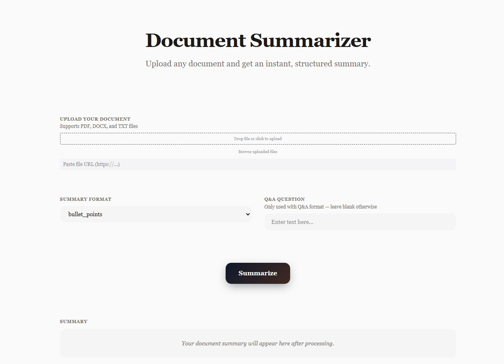

# document-summarizer-ai-agent
An AI agent that summarizes PDF, DOCX, and TXT documents instantly

# 📄 Document Summarizer AI Agent

An AI-powered agent that instantly reads and summarizes 
long documents in multiple formats — built with Claude AI.

## 🚀 About This Project
This agent was built using WeaveMind AI platform 
powered by Claude AI (Anthropic). Upload any document 
and get an instant structured summary in seconds!

## ✨ Features
- 📁 Upload PDF, DOCX, and TXT files
- 🔗 Paste any file URL directly
- 📝 Multiple summary formats:
  - Bullet Points
  - TL;DR
  - Executive Summary
  - Section-wise Summary
  - Action Items
  - Q&A Mode
- ⚡ Instant results powered by Claude AI
- 🎨 Clean and minimal UI

## 🛠️ Built With
- WeaveMind AI
- Claude AI (Anthropic)
- LangChain

## 💡 How It Works
1. Upload your document or paste a URL
2. Choose your preferred summary format
3. Hit Summarize
4. Get your structured summary instantly!

## 📸 Screenshot

## 🙋 Author
Rithika — [github.com/rithikaangel](https://github.com/rithikaangel)

## 📌 Note
This is my first AI project!!! Built as part of my journey 
into AI agent development. More projects coming soon! 🚀
